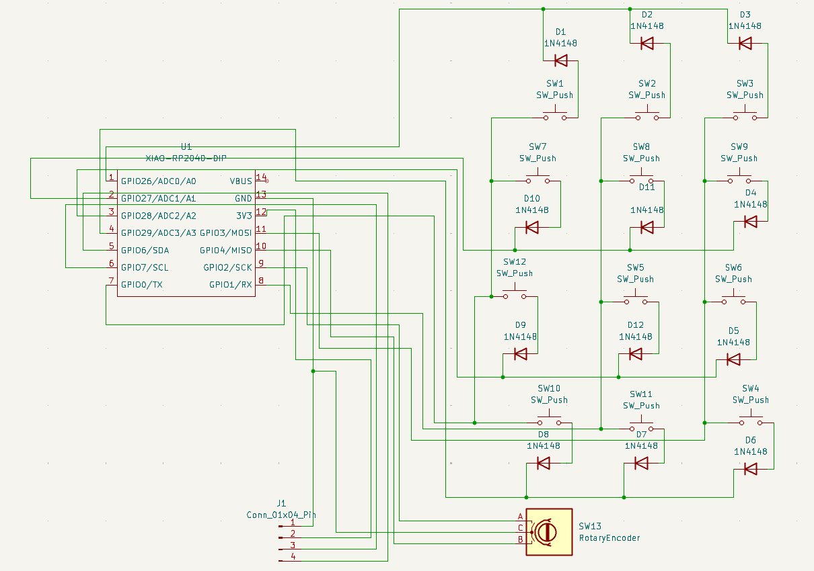
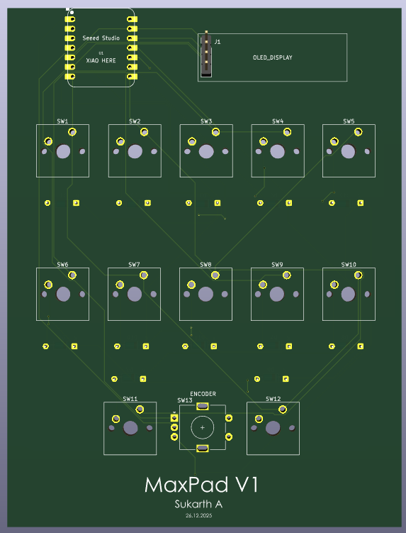

# MaxPad
My attempt at making a utility keypad with maximum functionality! It's a 5x3 ortholinear macropad featuring a rotary encoder and OLED display, designed for context-aware developer workflows. The custom PCB uses a Xiao RP2040 with a 3x4 matrix layout. Designed in KiCad and OnShape. The full KiCad project files are included in this repository inside [MaxPadProject.zip](MaxPadProject.zip).

## Images

### MaxPad Case

### MaxPad PCB Schematic

### MaxPad PCB

### Rendered MaxPad PCB (3D)

