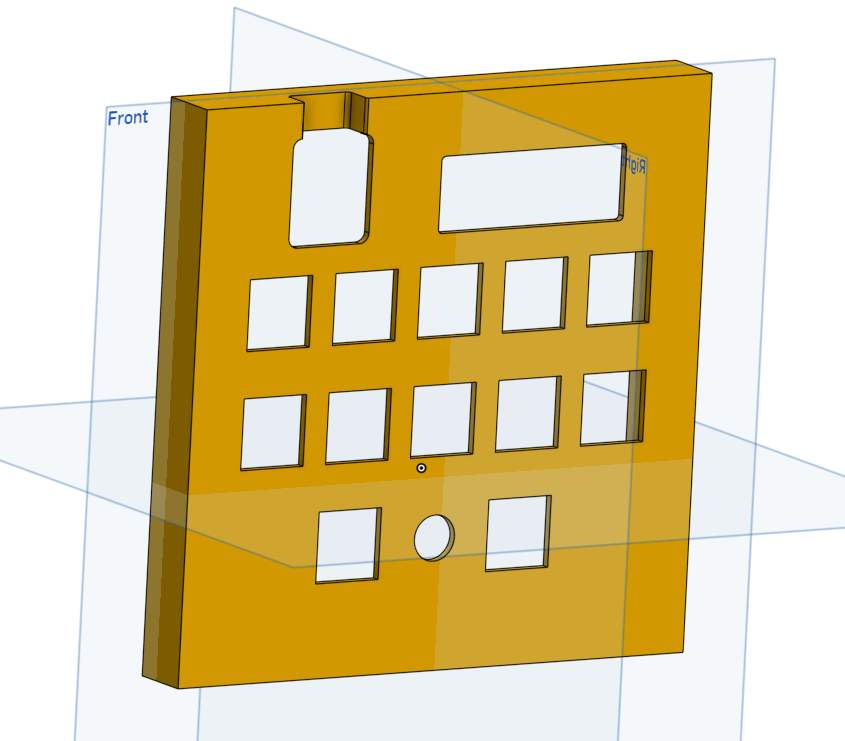
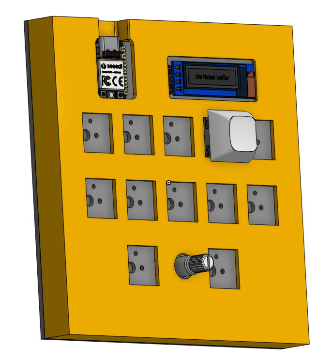
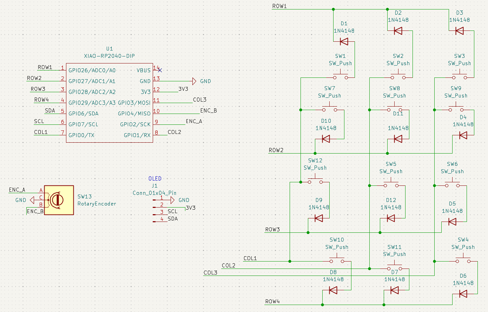
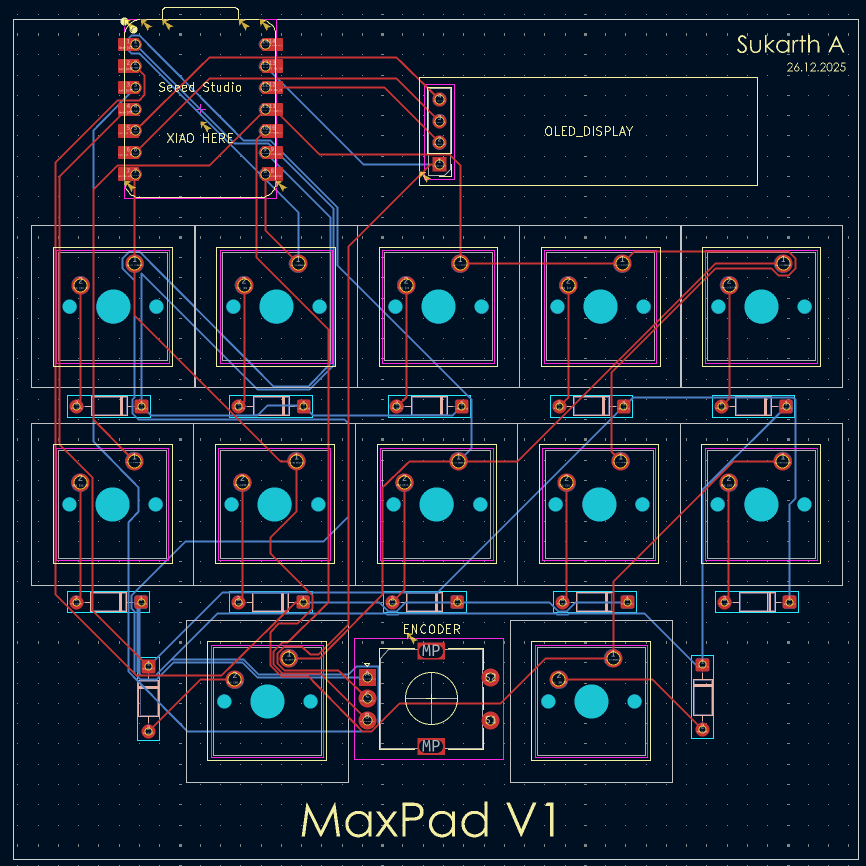
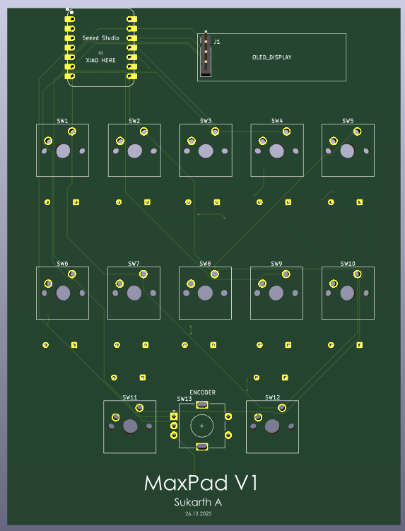

# MaxPad
My attempt at making a utility keypad with maximum functionality! It's a 5x3 ortholinear macropad featuring a rotary encoder and OLED display, designed for context-aware developer workflows. The custom PCB uses a Xiao RP2040 with a 3x4 matrix layout. Designed in KiCad and OnShape. The full KiCad project files are included in this repository inside [MaxPadProject.zip](MaxPadProject.zip).

Check out the custom built desktop companion/customization app for the MaxPad here: https://github.com/Sukarth/MaxPadApp 

## Images

### MaxPad Case

### MaxPad Full Assembly

### MaxPad PCB Schematic

### MaxPad PCB

### Rendered MaxPad PCB (3D)

## License
MIT. See [LICENSE](LICENSE) for more details.

## Support

If this project helps or saves you time, consider supporting my work, as it keeps projects like this free, open source, and maintained:

Can't donate? Starring the repo ⭐, reporting bugs, and sharing the project help just as much!

---

Built with ❤️ by Sukarth
